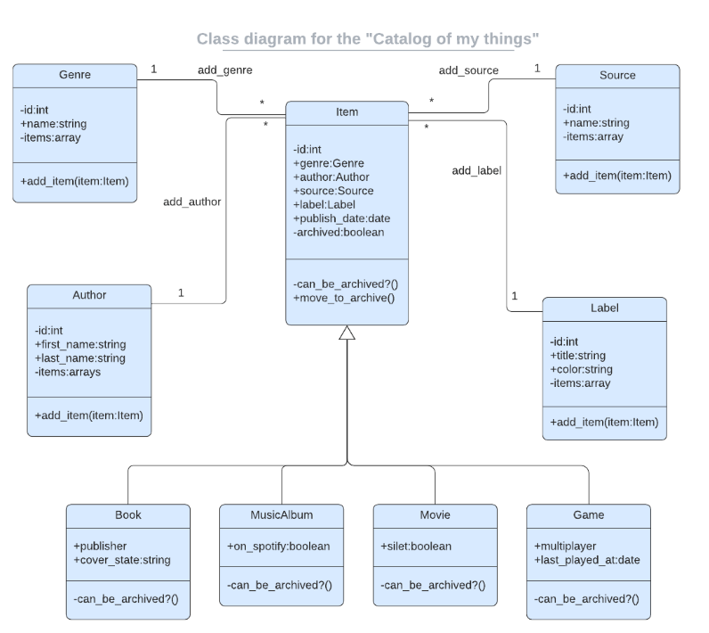

<a name="readme-top" align="center"></a>

<div align="center">
  <h1>Catalog Of My Things</h1>
  <br/>

</div>

<!-- TABLE OF CONTENTS -->

# 📗 Table of Contents

- [📖 About the Project](#about-project)
  - [🛠 Built With](#built-with)
    - [Tech Stack](#tech-stack)
    - [Key Features](#key-features)
  - [🚀 Live Demo](#live-demo)
- [💻 Getting Started](#getting-started)
  - [Setup](#setup)
  - [Prerequisites](#prerequisites)
  - [Install](#install)
  - [Usage](#usage)
  - [Run tests](#run-tests)
  <!-- - [Deployment](#triangular_flag_on_post-deployment) --> 
- [👥 Authors](#authors)
<!-- - [🔭 Future Features](#future-features) -->
- [🤝 Contributing](#contributing)
- [⭐️ Show your support](#support)
- [🙏 Acknowledgements](#acknowledgements)
- [📝 License](#license)

<!-- PROJECT DESCRIPTION -->

# 📖 Catalog Of My Things <a name="about-project"></a>
In this project, my partners [Elarh](https://github.com/elarhadu),[Yuvenal](https://github.com/yuvenalmash) and I created a console app that helps users to keep a record of different types of things they own: books, music albums, movies, and games. Everything is based on the UML class diagram presented below. The data will be stored in JSON files.

## 🛠 Built With <a name="built-with"></a>

### Tech Stack <a name="tech-stack"></a>

<details>
  <summary>Client</summary>
  <ul>
    <li><a href="https://www.ruby-lang.org/en/">Ruby</a></li>
  </ul>
</details>

<details>
  <summary>Database</summary>
  <ul>
    <li><a href="https://www.postgresql.org/">PostgreSQL</a></li>
  </ul>
</details>

<!-- Features -->

### Key Features <a name="key-features"></a>
- Add a Book
- Add a Game
- Create and manage data about my things
- Add a Music Album
- List all added items
- Keep track of books, music albums, movies, and games and other information

<p align="right">(<a href="#readme-top">back to top</a>)</p>

LIVE DEMO 

## 🚀 Live Demo <a name="live-demo"></a>
Please visit our zoom video presentation. Click the [Link](#) button.


### UML Diagram
 <div align="center">
  
 </div>


<p align="right">(<a href="#readme-top">back to top</a>)</p>

<!-- GETTING STARTED -->

## 💻 Getting Started <a name="getting-started"></a>

To get a local copy up and running, follow these steps.

### Prerequisites
In order to run this project you need:

- To install ruby in your PC. You can read [this](https://rubyinstaller.org/downloads/) documentation on how to do so
- Know how to navigate directories or folders at the CLI.
- Know how to get the URL(https/ssh) of a repository on GitHub.
- You should have a code editor installed, preferably VSCode.
- In order to run this project you need:

### Setup
In desired folder or directory in the CLI, run the command:

```sh
git clone git@github.com:leehaney254/Catalog-of-my-things.git
```

Navigate into the cloned folder or repository by running the command:
```sh
cd Catalog-of-my-things
```

If VsCode is your default code editor, run:
```sh
code .
```

You are all set up!
### Install

Install this project with:

```sh
 bundle install
``` 
### Usage

To run the project, execute the following command:

```sh
ruby main.rb
```

### Run tests

To run tests, run the following command:

```sh
  rspec spec spec/[filename.rb]
```

<!-- ### Deployment

You can deploy this project using:

```sh

```  -->

<p align="right">(<a href="#readme-top">back to top</a>)</p>

<!-- AUTHORS -->

## 👥 Author <a name="authors"></a>

👤 **Leehaney George**

- GitHub: [@leehaney254](https://github.com/leehaney254)
- Twitter: [@Lee06785586](https://twitter.com/Lee06785586)
- LinkedIn: [Leehaney George](https://www.linkedin.com/in/leehaney-george-0a4a51178/)

👤 **Emmanuella Adu**

- GitHub: [@elarhadu](https://github.com/elarhadu)
- Twitter: [@elarh\_](https://twitter.com/elarh_)
- LinkedIn: [Emmanuella Adu](https://linkedin.com/in/emmanuella-adu)

👤 **Yuvenal Njoroge**

- GitHub: [@yuvenalmash](https://github.com/yuvenalmash)
- Twitter: [@_Juvenal_](https://twitter.com/_Juvenal_)
- LinkedIn: [Yuvenal Njoroge](https://www.linkedin.com/in/yuvenal-njoroge/)

<p align="right">(<a href="#readme-top">back to top</a>)</p>

<!-- FUTURE FEATURES -->

## 🔭 Future Features <a name="future-features"></a>

```sh
Integration with PostgreSQL
```

<p align="right">(<a href="#readme-top">back to top</a>)</p>

<!-- CONTRIBUTING -->

## 🤝 Contributing <a name="contributing"></a>

Contributions, issues, and feature requests are welcome!

Feel free to check the [issues page](https://github.com/leehaney254/Catalog-of-my-things/issues).

<p align="right">(<a href="#readme-top">back to top</a>)</p>

<!-- SUPPORT -->

## ⭐️ Show your support <a name="support"></a>

If you like this project give us ⭐

<p align="right">(<a href="#readme-top">back to top</a>)</p>

<!-- ACKNOWLEDGEMENTS -->

## 🙏 Acknowledgments <a name="acknowledgements"></a>

I would like to thank [Microverse](https://github.com/microverseinc) for this project inspiration.

<p align="right">(<a href="#readme-top">back to top</a>)</p>

<!-- LICENSE -->

## 📝 License <a name="license"></a>

This project is [MIT](./LICENSE) licensed.

_NOTE: we recommend using the [MIT license](https://choosealicense.com/licenses/mit/) - you can set it up quickly by [using templates available on GitHub](https://docs.github.com/en/communities/setting-up-your-project-for-healthy-contributions/adding-a-license-to-a-repository). You can also use [any other license](https://choosealicense.com/licenses/) if you wish._

<p align="right">(<a href="#readme-top">back to top</a>)</p>
